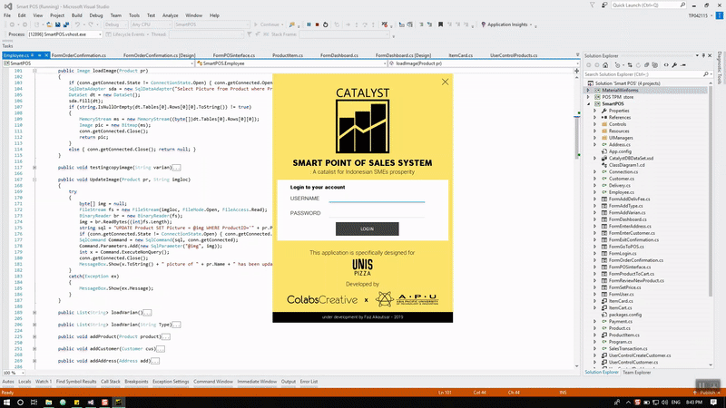

  

<h1 align="center">
  Catalyst: SME-specialized POS System with Business Intelligence
</h1>

Catalyst Point-of-sales (POS) system has aim to foster the growth of Small and Medium Enterprise (SME) in Indonesia. This program is integrated with Microsoft Power Business Intelligence. Integrating the system with Power BI is very useful for intended users because it gives real data visualization of the captured modelled data. With this data visualization feature, users will be presented straight-forward information that hopefully can help business owners to formulate strategies to grow the business.

> This system is part of my Business Information Systems degree completion. Further details can be found [here](https://drive.google.com/file/d/1WieEYHdmAAT-ZQkZRTqmf5LBN4HPfogh/view?usp=sharing).

## :page_facing_up: System Features

- User authentication and role-based access
- Add, edit, delete product
- Add, edit, delete order
- Add, edit, and delete customer
- Generate report
- Auto sync and upload database to Power BI

## :computer: Tech Stack

| Type                 | Stack              |
| -------------------- | ------------------ |
| Framework            | .NET Framework 4.5 |
| Programming Language | C#                 |
| Database             | SQL Server 2014    |
| Data Analytics Tool  | Microsoft Power BI |
| IDE                  | Visual Studio 2015 |

## Demo

